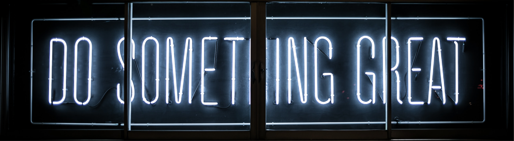

  

<h1 align="center">👋 Hello, I'm Ashim Shrestha!</h1>

I'm a Student at Humber 🌍

## 💼 My Work

- 🚀 Currently working on [Your Current Project]
- 💡 Exploring [Your Interests/Hobbies]

## 🌱 I'm Currently Learning

- [A Technology or Skill You're Learning]
- [Another Technology or Skill You're Learning]

## 🔧 Tools & Technologies

- 🖥️ [List of Programming Languages, Tools, and Technologies]
- 📚 [Books You're Currently Reading]
- 🎮 [Your Favorite Video Games]

## 📫 How to Reach Me

- 📧 Email: [Your Email Address]
- 💬 [LinkedIn](https://www.linkedin.com/in/your_username)
- 🐦 [Twitter](https://twitter.com/your_username)

## 🚀 Fun Fact

[An interesting and fun fact about yourself]

  

<!-- Add any additional sections, images, or customizations you want -->
